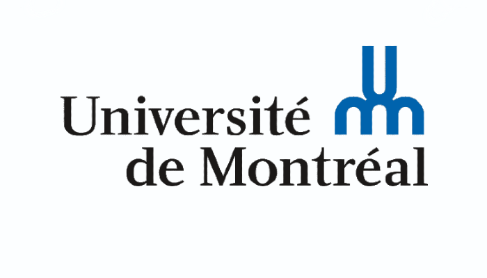

## [Publications](publications.md) | [CV](CV.md) | [Projects](projects.md) | [Awards](awards.md)

 
 
 
 

Hi, I am Subhamoy!

I am a research candidate in the Master of Applied Science in Electrical and Computer Engineering program at University of Waterloo, advised by [Prof. Mahla Poudineh](https://uwaterloo.ca/electrical-computer-engineering/profile/m2poudin) at the [Integrated Devices for Early Disease Awareness and Translational Applications (IDEATION) Lab](https://uwaterloo.ca/integrated-devices-early-awareness-lab/). I am currently working on:

1. time-series models for long-term glucose monitoring and forecasting diabetic ketoacidosis in patients
2. fabrication and optimization of minimally-invasive microneedles for bioanalyte detection

 I received my Bachelor of Engineering degree with Honours in Electrical Engineering from Jadavpur University, India. During my undergraduate years, I developed multiple computational frameworks for applications like detecting therapeutic drug targets in viruses and simulating the dynamics of atrial fibrillation. My research interest lies in the domains of computational biology and biomedical devices and in applying machine learning approaches to solve state-of-the-art bioengineering problems.
 
 
 I have enjoyed working at the following institutions:
 
 
        
 
 
 In my free time, I enjoy reading and watching horror stories.
 
 
 
### <a href="mailto:s2biswas@uwaterloo.ca" target="_top">Email</a> | <a href="https://github.com/SubhamoyBiswas/" target="_top">GitHub</a> | <a href="https://www.linkedin.com/in/subhamoy-biswas-16869316a/" target="_top">LinkedIn</a> | <a href="https://scholar.google.ca/citations?user=bHMeN1UAAAAJ&hl=en" target="_top">Google Scholar</a> | <a href="https://www.instagram.com/__subhamoy.b/" target="_top">Instagram</a>
 
 
