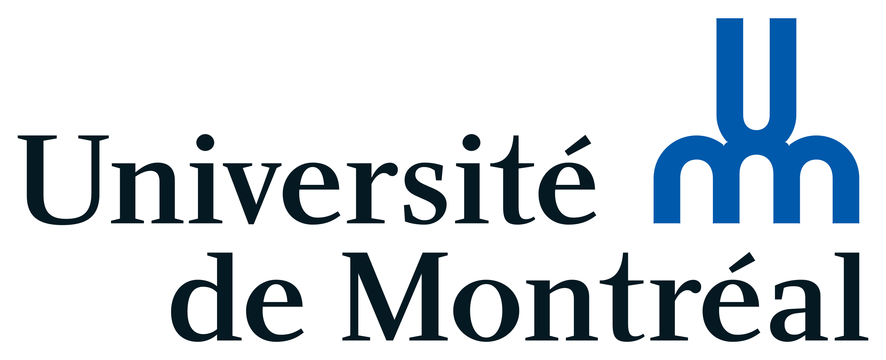

        <!--

           <ul>
                <li>
                    <a href="https://subhamoybiswas.github.io/home/" class="active">
                        About
                    </a>
                </li>
                <li>
                    <a href="https://subhamoybiswas.github.io/home/projects.html">
                        Projects
                    </a>
                </li>
                <li>
                    <a href="https://subhamoybiswas.github.io/home/publications.html">
                        Publications
                    </a>
                </li>
                <li>
                    <a href="https://subhamoybiswas.github.io/home/awards.html">
                        Awards
                    </a>
                </li>
                <li>
                    <a href="https://subhamoybiswas.github.io/home/CV.html">
                        CV
                    </a>
                </li>
            </ul>
        
 
        

            Hi, I am Subhamoy! 
            I am a research candidate in the Master of Applied Science in Electrical and Computer Engineering program at University of Waterloo, advised by <a href="https://uwaterloo.ca/electrical-computer-engineering/profile/m2poudin">Prof. Mahla Poudineh</a> at the <a href="https://uwaterloo.ca/integrated-devices-early-awareness-lab/">Integrated Devices for Early Disease Awareness and Translational Applications (IDEATION) Lab</a>. I am currently working on: 
             1. time-series models for long-term glucose monitoring and forecasting diabetic ketoacidosis in patients
             2. fabrication and optimization of minimally-invasive microneedles for bioanalyte detection
             
             
             
             I received my Bachelor of Engineering degree with Honours in Electrical Engineering from Jadavpur University, India. During my undergraduate years, I developed multiple computational frameworks for applications like detecting therapeutic drug targets in viruses and simulating the dynamics of atrial fibrillation. My research interest lies in the domains of computational biology and biomedical devices and in applying machine learning approaches to solve state-of-the-art bioengineering problems.
             
             
             I have enjoyed working at the following institutions:
             
             
                    
             
             
             In my free time, I enjoy reading and watching horror stories.
             
             
        
 -->

## Projects
 
<ul>
	<li><b>Machine learning-assisted continuous glucose and ketone monitoring for diabetic ketoacidosis</b> - University of Waterloo<ul>
		<li> Supervisor - <a href="https://uwaterloo.ca/electrical-computer-engineering/profile/m2poudin">Prof. Mahla Poudineh</a></li>
		<li> September 1, 2022 - August 13, 2024</li>
		<li> <a href="https://hdl.handle.net/10012/20794">Thesis link</a></li> 
		<li> Summary - Type 1 diabetes impacts millions worldwide, requiring rigorous monitoring of blood glucose to avoid severe complications like hyperglycemia and diabetic ketoacidosis. Continuous glucose monitoring (CGM) devices measure glucose levels from interstitial fluid (ISF) in real-time, facilitating effective treatment. While existing machine learning models excel in short-term glucose predictions, they often overlook the need for long-term forecasting essential for optimizing insulin therapy. This work introduces an encoder-decoder model that extends the forecasting horizon from 1 to 3 hours, potentially improving insulin delivery accuracy. Additionally, ISF-based sensors face challenges with sensing delays due to varying glucose and other analyte transfer times from blood to ISF. This work also examines these delays using decision-tree algorithms and an in vivo diabetic rat study using the cases of continuous glucose and continuous ketone monitoring to enhance sensor accuracy and enable more personalized monitoring of such analytes.</li> 
	</ul></li>
	<!-- <li><b>International Master's Award of Excellence</b> - University of Waterloo<ul>
		<li> $12,500 - Awarded based on academic excellence demonstrated through application for admission to graduate program</li> 
	</ul></li>
	<li><b>Globalink Graduate Fellowship</b> - Mitacs Inc., CA<ul>
		<li> $15,000 - Awarded for pursuing research masters in Canada</li> 
	</ul></li>
	<li><b>Senior Scholarship</b> - Jagadis Bose National Science Talent Search, India<ul>
		<li> $3,500 (converted) - Awarded to “top 73/2000+” undergraduate applicants in West Bengal, India, based on a 3-level competition in natural sciences</li> 
	</ul></li> -->
</ul>
 
<!-- ### [<< return to homepage](README.md) -->
